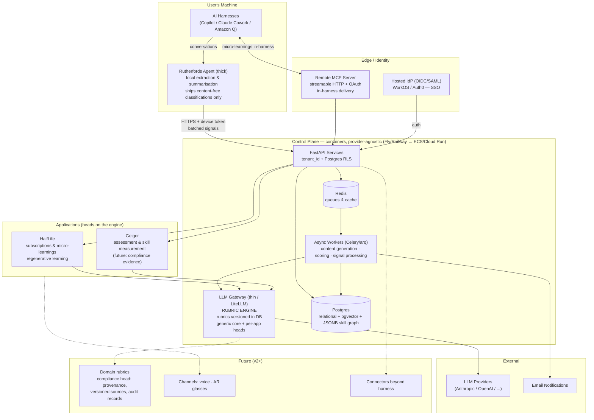
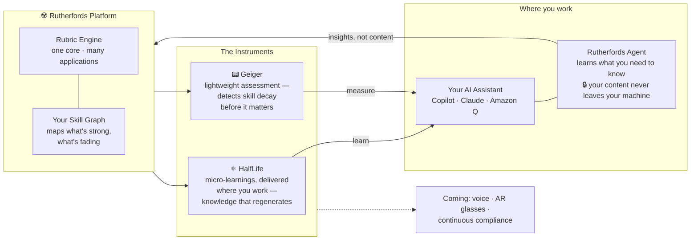

# Rutherfords — Platform Design Doc (v0.2)

*Ideation output, August 2026. Status: HalfLife part-built, the rest concept only.*

HalfLife is the product this repository builds. Rutherfords is the platform it is one
instrument of, and everything about the platform below is unbuilt. The document is
product intent; [CLAUDE.md](CLAUDE.md) is what must hold in code, and where the two
disagree CLAUDE.md wins.

## Concept

Professional skill maintenance. Skills decay ("I was good at algebra at school; now I'd have to relearn it"). The platform assesses where people are, detects drift between what they know and what their role demands, and periodically delivers content to keep skills fresh — regenerative learning.

**Positioning:** most learning tools help you acquire something new; this one helps you *keep* what you already learned. A maintenance product, not an acquisition product — which is what makes decay, freshness and cadence the load-bearing concepts rather than courses and completion.

**Name:** **HalfLife** — the decay metaphor stated outright: every skill has one, and the product's job is to keep topping you back up before yours runs down.

## Audience

- Professional tool (career skill maintenance), not consumer.
- The design target is the forward-deployed / field engineer shape of role: constant exposure to
  unfamiliar customer stacks, high topic churn, and most of the working day spent inside an AI
  harness. Several decisions below only make sense against that user — the harness-only sensor
  surface especially.

## Platform context — Rutherfords

*Added from an ideation session, 2026-08-21. This section describes a platform of which HalfLife
is one product. Nothing in it is built, and nothing in it changes the build order in
[CLAUDE.md](CLAUDE.md) — see "What this changed, and what it did not" at the end of the section.*

Rutherfords is the lab; the products are its instruments. **HalfLife** delivers regenerative
micro-learning where you work. **Geiger** detects skill decay through lightweight assessment. Both
are heads on a shared **rubric engine**.

Geiger is new here and has no code, no schema and no design beyond the paragraph above. It is
recorded because it changes what the core has to be — a core serving one head is just that head's
internals, and the engine/head split below only earns its complexity if there is genuinely a
second consumer.

### Design principles

- **Engine + heads.** One shared core (topic model, skill graph, depth calibration, user context)
  with per-application rubrics layered on top. Generation and assessment have different quality
  criteria — do not force them through one rubric.
- **Thick local agent.** All extraction and summarisation of harness conversations happens on the
  user's machine. Only content-free classifications ("insights, not content") are shipped to the
  control plane.
- **Boring technology.** Containers + Postgres + Redis. Provider-agnostic via 12-factor
  containers, not Kubernetes. Spend the complexity budget on the rubric engine, skill graph and
  agent; rent everything else.
- **Rubrics as data.** Rubrics are versioned in the database (prompt + validation), not hardcoded.
  Domain-specific rubrics (first target: continuous compliance) plug in at the gateway layer.

### System architecture



### Key flows

1. **Signal capture.** The local agent reads harness conversations, performs extraction and
   summarisation locally, and POSTs batched content-free classifications to the control plane over
   HTTPS using a device token (pairing-code onboarding).
2. **Content generation.** Workers pull from the queue, call the rubric engine via the LLM
   gateway, and persist micro-learnings / assessment items to Postgres.
3. **Delivery.** The hosted remote MCP server (streamable HTTP + OAuth) serves micro-learnings and
   assessments back into whichever harness the user is in — harness-agnostic by design. Multiple
   harnesses (for example Claude Code and Claude Cowork) can run against the same instance
   concurrently.
4. **Identity.** All API access is authenticated via a hosted IdP (OIDC/SAML). Multi-tenancy is a
   `tenant_id` column with Postgres row-level security — the honest migration path to single-tenant
   deployments later.

### Marketing overview

Simplified for external audiences. The only technical claim it makes is the one that matters
commercially: *your content never leaves your machine — only insights do.*

That claim is true of extraction today and is not true of generation on the API path, which sends
the topic and the coverage ledger to Anthropic. On the harness path nothing leaves the machine but
the model call the harness was already making. Any use of this diagram needs to survive somebody
asking which path they are on.



### What this changed, and what it did not

Consistent with what is already built or already written down: the thick local agent, content-free
classifications, `tenant_id` on every table, harness-agnostic delivery over MCP, the skill graph as
a deferred v2 surface, and topics normalised centrally rather than shipped to the agent. Postgres
RLS is a refinement of the tenancy rule rather than a change to it.

New, and unbuilt: Geiger, the engine/head split, the LLM gateway, Redis and async workers, the
hosted remote MCP server, and the domain-rubric plug-in point.

**Three things contradict what is currently written, and are open decisions rather than settled
ones.** They are listed here rather than merged, because each changes work already planned.

1. **Kubernetes.** This session says "provider-agnostic via 12-factor containers, **not**
   Kubernetes", with Fly or Railway first and ECS or Cloud Run later. The architecture section
   below still says Helm/K8s, and step 4 of the build order in [CLAUDE.md](CLAUDE.md) is
   "Containerise → Helm → k3d → EKS". These cannot both stand. The newer position removes most of
   step 4, which makes it the larger claim and the one that needs deciding deliberately rather
   than by whichever document is read last.
2. **Rubrics as data.** Rubrics versioned in the database contradicts the convention that prompts
   are versioned Python constants in a `prompts` module, and it moves where a version lives. The
   current arrangement is what makes `depth_rubric_version` on a delivery attributable to a commit;
   a database-versioned rubric is attributable to a row, which is a different guarantee and needs
   its own migration and audit story. Worth noting that the reason for rubrics-as-data is
   per-tenant domain rubrics, which nothing today needs.
3. **Concurrent harnesses.** Key flow 3 states that multiple harnesses can run against one
   instance concurrently. That is asserted as a design property and is currently false in the
   code: see [issues #1–#4](https://github.com/Snorn/halflife/issues), which record that there is
   no dedupe on subscribe, no lease or conditional write between brief and record, and no way for
   a caller to detect that its state is stale. The remote MCP server makes this worse rather than
   better, because it turns two harnesses on one laptop into many harnesses across many machines.

## Architecture — HalfLife

*Predates the platform section above. The control-plane bullet is the one it contradicts:
Helm/K8s here, 12-factor containers and explicitly not Kubernetes there. Left standing
rather than edited, because striking it would make the decision look taken.*

- **Control plane:** cloud-native, containerised, deployable to any cloud (Helm/K8s; EKS/AKS/GKE or on-prem later). Holds API, dashboards, micro-learning scheduler/generator, skill graph store. Postgres suffices for the graph (nodes + edges tables).
- **Agent:** runs locally, **thick** — does extraction/summarisation locally using the harness's own model, ships only conclusions. Harness-agnostic via **MCP**: one MCP server, thin per-harness wrappers only where required. Targets: Copilot, Claude Cowork, Amazon Q.
- **Identity/tenancy:** SSO required (OIDC/SAML via off-the-shelf, e.g. Keycloak or Entra — no hand-rolling). Multi-tenant SaaS initially; tenant_id first-class on every table so single-tenant is a deployment change later, not code surgery.
- **Roles:** user, team lead, org admin. Team views are aggregate-only, enforced at the API layer. Per-user profiles visible only to the user themselves; manager sees team-level rollups.

## v1 scope: zero-permission

- Sensor surface is **harness conversations only** — no email, calendar, or document access. No OAuth consent screens, no security-review blockers. Connectors are deferred to a later version.
- What v1 actually delivers: (1) micro-learning subscriptions (day-one value), (2) emergent skill profile from what users ask their AI, (3) team view of aggregated topics and subscription trends. Decay detection proper arrives when connectors provide time-depth (v2).

## Micro-learning engine

User-requested subscriptions, AI-generated content:

- Parameters: **topic/domain, depth (1=basic … 5=advanced), duration (minute read), frequency (hourly/daily/weekly)**. Power-user shorthand: `sap web dispatcher, 3, 5, 1d`. Dropdowns for everyone else.
- Depth anchored by an explicit rubric in the generation prompt (1 = plain-language overview → 5 = edge cases, internals, expert nuance).
- **Continuity:** store a summary of what each series has covered; feed it into each generation so day 4 builds on days 1–3.
- Frequency default capped at daily; hourly exists for cramming scenarios.
- **Delivery: in-harness** (conversational — follow-up questions become free depth-feedback signals), with **email as the nudge**. MCP tool shape: `get_pending_microlearnings` called at session start.
- Two subscription flavours, labelled distinctly: **learning** (new topics) and **maintaining** (refreshers on strong skills — gentle default frequency, depth matched to claimed strength).

## Skill graph

- **Team-specific and emergent**, not a predefined taxonomy. Starts empty; AI-generated from ambient signals and end-user topic submissions.
- LLM pass normalises free-text topics ("k8s" → "Kubernetes"), deduplicates, proposes parent/child edges ("SAP Web Dispatcher" is-part-of "SAP Basis").
- Two tiers: shared team graph (coverage, freshness) + per-user overlays (individual strength/recency).
- Human-in-the-loop: AI proposes merges/hierarchy; users/admin confirm via a review queue. Corrections improve the normalisation prompt.
- Topics are free-text at the edge, normalised centrally — the taxonomy never ships to the agent.

## Signal schema (the privacy boundary)

Rule: **the control plane never sees content — only classifications.**

Envelope: `schema_version, signal_id, tenant_id, user_id, timestamp, agent {harness, agent_version, extraction_prompt_version}`.

Body:

```json
{
  "topics": ["SAP Web Dispatcher", "SSL termination"],
  "signal_type": "asked_basic | asked_advanced | explained_to_ai | applied | struggled | delegated | topic_submission",
  "confidence": "low | medium | high",
  "context_category": "coding | troubleshooting | research | writing | meeting-prep",
  "session_id": "hash",
  "evidence": null
}
```

Key decisions:

- Signal types are **coarse behavioural verbs, not scores** — robust to model variance across harnesses. `explained_to_ai` = strongest competence signal; `struggled` = strongest gap signal; `applied` = quiet competence.
- `confidence` = the agent's confidence in its own classification.
- `evidence` is **permanently null** — not "null for now". The column exists so the privacy stance is auditable, not as a staging area for a later opt-in. Enforced rather than intended: `repository.signals.assert_no_content` refuses any row that carries one.
- `session_id` is a hash (dedupe without content linkage). No conversation IDs, no user text, no model output, no duration/keystroke telemetry.
- Extraction prompt is versioned and identical across harnesses.
- **Aggregation rule:** raw signals are write-only inputs; every human-visible surface is built from time-windowed aggregates. Nobody browses individual signals, including org admins.
- Planned feedback loop: users can confirm/reject inferred skills; corrections are training gold.

## Dashboards

- **User:** skill profile with per-skill freshness/decay indicator (green→amber→red), active subscriptions (edit/pause), delivered-reads feed with too-basic/too-advanced feedback that auto-adjusts depth, light stats.
- **Management:** skills × team heatmap (coverage + decay risk), trending requested topics, aggregate-only.

## Onboarding flow (~10 minutes to first value)

1. **Invite** → SSO → one-screen consent showing the *actual signal schema* and the off switch. Explicit consent click, logged.
2. **Agent install** (per-harness instructions); registers via short-lived pairing code; dashboard shows "agent connected."
3. **Seed the profile** — two questions: "What are you working on right now?" (→ topics/subscriptions) and "What do you know well that others ask you about?" (→ high-confidence competence nodes). LLM proposes graph nodes; user confirms with checkboxes.
4. **First subscription** created guided; **first micro-learning generated immediately on-screen** — value in minute eight, not day two. Seeded competence topics **auto-create maintenance subscriptions**.
5. **Expectations screen:** "Profile builds itself over 2–3 weeks. Daily reads arrive in [harness], nudged by email."

In-harness first-run: one sentence ("Skill tracker active — classifications only, no content leaves. Say 'pause tracking' anytime"), then silent unless delivering or asked.

Admin flow (tenant/team/invites) stays manual/scripted for a first deployment. Instrument the funnel: invite → consent → connected → seeded → first subscription → first read opened.

## v2 feature list

- Connector support (email, calendar, docs — beyond harness-only signals)
- Decay detection proper (needs connector time-depth)
- Auto-pause/resume maintenance subscriptions based on `applied` signals (candidate)
- Geiger, the engine/head split, the LLM gateway, the hosted remote MCP server and
  domain rubrics — see [the platform section](#platform-context--rutherfords), which is
  where these are described rather than here, because they are platform-level and this
  list is HalfLife's

## Open items

1. Micro-learning generation quality — depth rubric wording, continuity mechanism (the week-one make-or-break for any first deployment)
2. Pressure-test the signal schema against a concrete scenario (e.g. a field engineer's first week on an unfamiliar customer stack)
3. **Kubernetes or not.** The platform section says 12-factor containers and not Kubernetes;
   the architecture section and step 4 of the build order say Helm, k3d and EKS. Deciding
   this removes or keeps most of a build step, so it wants deciding on purpose.
4. **Where a rubric version lives.** Rubrics as data in the database, against prompts as
   versioned Python constants. Today `depth_rubric_version` on a delivery points at a commit;
   a database rubric points at a row, which is a weaker guarantee unless the row is
   immutable. The motivation is per-tenant domain rubrics, which nothing needs yet.
5. **Concurrent harnesses.** The platform assumes many; the code supports one at a time.
   Tracked as [issues #1–#4](https://github.com/Snorn/halflife/issues).

*Closed: product name — settled as **HalfLife**.*

*Closed: opt-in `evidence` paraphrase. It was listed here as a v2 candidate while CLAUDE.md forbade it by name, so the two source-of-truth documents disagreed about the same field. Settled against: an opt-in is how a permanently-null column stops being permanently null, and the consent it would rest on is the weakest part of the design — the person clicking it is the one with the least to lose and the most to gain from clicking. If self-review is wanted, it needs a mechanism that does not put content in the control plane, decided on the record.*
